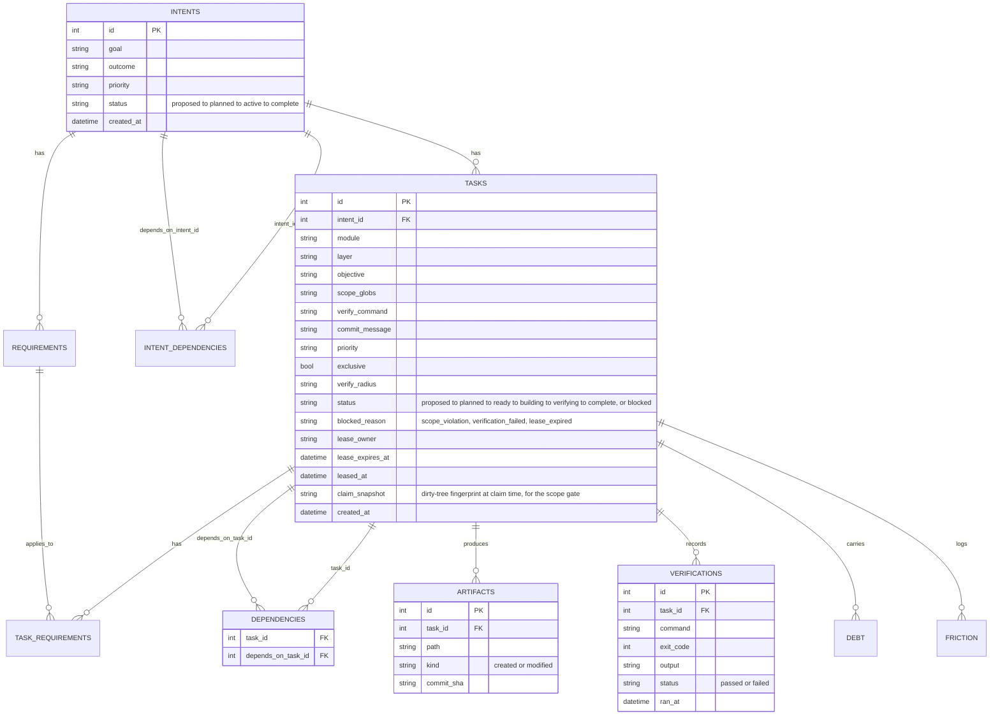

# The build graph

Hedgehog stores its build state in one SQLite database:

```text
.hedgehog/hedgehog.db
```

Its core is five tables:

| Table           | Purpose                                           |
| --------------- | -------------------------------------------------- |
| `intents`       | What is being built                               |
| `tasks`         | The work to perform, plus who currently leases it |
| `dependencies`  | What must finish first                            |
| `verifications` | The result of each `verify_command` run           |
| `artifacts`     | The files each completed task produced            |

The full schema is laid out in [Schema](#schema) below.

The rest of the system is built on top of these five tables:

```text
5 tables
  ↓
intents → tasks → dependencies
  ↓
readiness
  ↓
claim → build → verify
  ↓
parallel agents
  ↓
artifacts + Git
  ↓
review checkpoints
```

## 1. Intents become tasks

An **intent** is a domain module, such as `orders` or `billing`.

A **core** (`.hedgehog/core.yaml`) defines the layers used to build an intent:

```text
schema → repository → service → controller → screen
```

`hedgehog plan` combines the two.

For each intent, it creates one task for each layer:

```text
orders
  schema → repository → service → controller → screen

billing
  schema → repository → service → controller → screen
```

Dependencies connect the tasks within each intent. Intents can also declare dependencies on other intents.

Layers marked `once: true` are created only once rather than once per intent.

Each task also carries the requirements that apply to it: rules, constraints, acceptance criteria, and its allowed scope.

## 2. Readiness comes from dependencies

Hedgehog does not need a separate scheduler.

A task is ready when:

* it is `planned` or `ready`
* nobody currently holds its lease
* every dependency is `complete`

Conceptually:

```text
task
 ├─ status is planned/ready?
 ├─ no active lease?
 └─ all dependencies complete?
          ↓
        ready
```

The CLI evaluates this directly against SQLite whenever it looks for work.

## 3. Tasks have one lifecycle

A task is a row in `tasks`.

```text
planned → ready → building → verifying → complete
```

A task can also become `blocked` when verification fails or its scope is violated.

The state is enough to describe where the task is in the build.

## 4. Agents claim ready work

An agent asks for a task:

```bash
hedgehog claim --owner me
```

Hedgehog finds a ready task and creates a lease.

The agent receives the information it needs to work:

```text
objective
requirements
allowed scope
verify command
```

The agent then builds the task.

## 5. Verification controls completion

When the agent is finished:

```bash
hedgehog verify <task> --owner me
```

Verification happens in order:

```text
Git diff
   ↓
scope check
   ↓
verify_command
   ↓
commit
   ↓
complete
```

If the agent changed files outside its allowed scope, the task is blocked.

If verification fails, the task is blocked.

If everything passes, Hedgehog commits the allowed changes and marks the task complete.

While any task in the graph is blocked, `hedgehog claim` refuses to hand out any fresh work. `hedgehog next` and `hedgehog status` both report blocked tasks directly.

## 6. Multiple agents can work at once

The lease is what makes parallel work possible.

A task being built or verified has:

```text
lease_owner
lease_expires_at
```

Another agent cannot claim the same task while its lease is active.

Because agents claim different ready tasks, several can work concurrently without a separate queue or lock server.

All agents share one working tree. A changed file counts against a task when:

1. It falls inside that task's own scope.
2. It wasn't already touched before the task was claimed.

A file inside another in-flight task's scope belongs to that task instead.

## 7. Artifacts and Git both record what was built

A completed task writes to two places.

The `artifacts` table records which files the task produced, indexed by task. Git records the same change as a commit containing the task's in-scope diff.

```text
artifacts table → which files belong to which task
Git commit       → the actual content, with full history
```

SQLite tracks current build state; Git holds the durable content. Because every completed task maps to a commit, the database can be rebuilt from the commit history if needed.

## 8. Verification and Review

`hedgehog verify` runs on every task, but only checks what a machine can check: scope and exit code.

A separate `reviewer` role covers more at a few checkpoints instead of every commit:

* Before Phase B opens for a module.
* When a layer closes on an authored core
* During the Correction Protocol, when an upstream step turns out wrong.

The reviewer reports findings, and a Block goes back through the Correction Protocol to be fixed at its source.

## Schema

Nine tables in total:



Column detail above is shown for the tables agents read and write most: `intents`, `tasks`, `dependencies`, `artifacts`, `verifications`.

## In short...

```text
dependencies → readiness
leases       → concurrency
verification → correctness
Git          → completion
```

The graph, task ownership, verification, and completion all come from the same small set of primitives.
