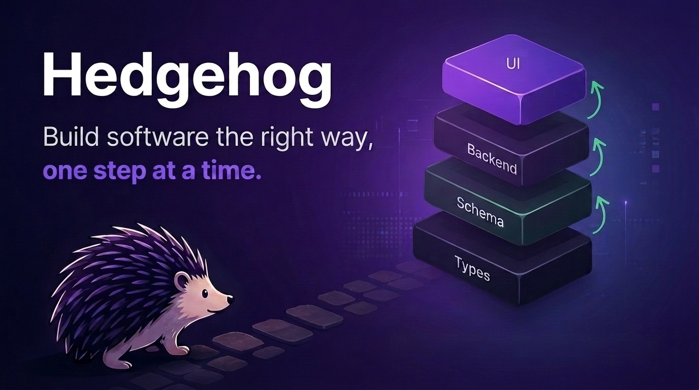
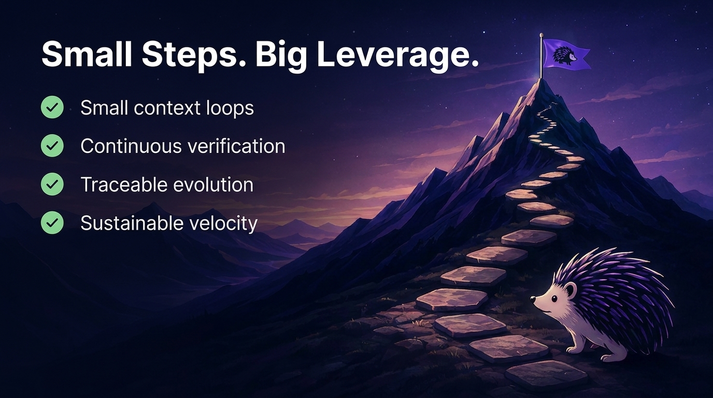
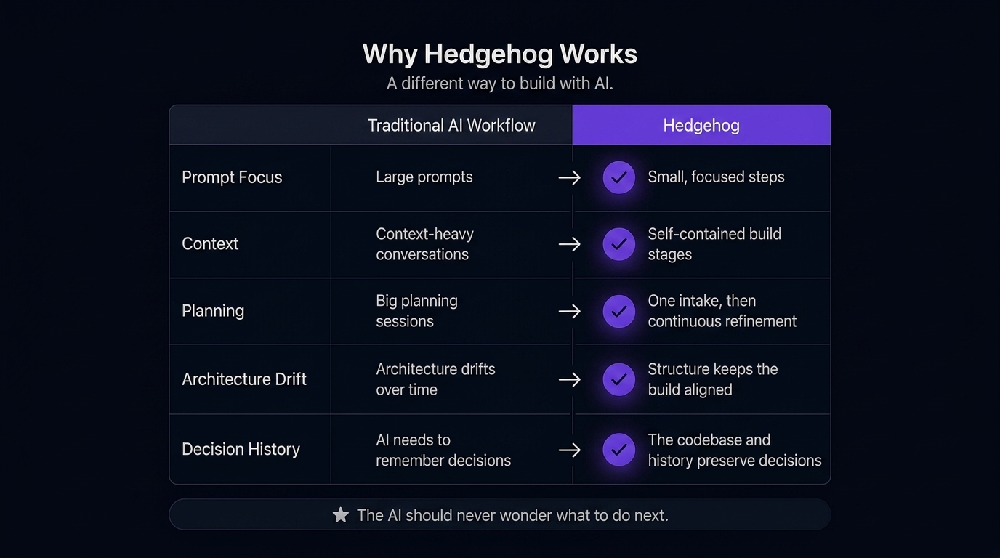

# The Antidote to AI Spaghetti Code

AI can write code faster than humans ever could.

But **speed without discipline creates chaos**.

Hedgehog gives AI the guard-rails it needs to **build software that stays clean.**

A complete development methodology combining:

- structured workflows
- opinionated architecture
- composable skills
- incremental build loops
- enforced quality gates

**Build faster, Save context**. Stay aligned. Ship software you can still understand six months later.



## Hedgehog gives AI

1. An opinionated stack
2. An enforced build order
3. Agents and skills that make good engineering the default.

## Hedghog's secret to great outcomes

- 🧩 **Progressive layering:** types → schema → backend → UI, each layer built on a stable one beneath it
- 🎯 **Small context loops:** decompose work into atomic, verifiable changes
- 🌳 **Self-documenting architecture:** the codebase carries the context, not the AI
    AI
- 🔁 **Traceable evolution:** decisions are preserved through conventional commits

## Why Hedgehog Exists

AI coding starts fast then breaks down.

Context accumulates, prompts get longer, architecture drifts.

Eventually, adding one more feature feels
dangerous.

**The enemy isn't AI. It's the absence of guardrails.**

## Plans Expire. Structure Doesn't

Without a build order enforced mechanically, an AI (or a person) has to carry the whole plan in its head: architecture, sequencing, past decisions, etc. as an ever-growing prompt.

Hedgehog doesn't ask the AI to remember a plan. It makes the plan visible in the structure of the build. The architecture itself guides the next step.

### The AI should never wonder what to do next

Instead of asking AI to hold an entire application in context, Hedgehog turns the build into a sequence of small, deterministic steps.

Each module is built progressively: schema → contract → repository → service → controller. Every step is gated by tests and committed before the next begins.

Backend comes first. Every module gets a working, typed API before any screen is built. The frontend becomes a consumer of stable capabilities, not a parallel source of complexity.

The build order is not something you negotiate with the AI. It is encoded into the process.



## The Hedgehog Loop

``` text
Bootstrap (once per project)
  ↓
Intake — scope boundary + domain vocabulary (planner agent)
  ↓
Phase A, per module — schema → contract → repository → service → controller
  ↓
Phase A closes for the module (gated: typecheck, lint, test)
  ↓
Phase B, per module — hook → UX rationale → screen
  ↓
Repeat for the next module or the next step
```




## For Builders

Hedgehog brings proven software engineering practices into AI-assisted development.

Once the project brief is defined, Hedgehog takes over the execution: breaking the work into steps, following the build order, validating progress, and keeping decisions traceable.

Under the hood, it applies the practices experienced engineers rely on:

- iterative delivery
- small units of work
- an opinionated stack
- clear architectural boundaries
- ports and adapters
- continuous verification
- conventional commits

AI becomes the builder operating inside those constraints — turning ideas into software without requiring you to manage every implementation detail.

## Architecture

Hedgehog is a package of agents and skills. An opinionated stack is used so the build order above is mechanical and enforced by the tooling itself:

| Layer | Choice | Why |
| --- | --- | --- |
| Monorepo | Nx | Enforces module boundaries at compile time. |
| Package manager | pnpm | Prevents accidental cross-package dependencies. |
| Backend | NestJS | Modules naturally mirror Hedgehog's build progression. |
| ORM | Drizzle + drizzle-zod | Database schema is the single source of truth. |
| Database | PostgreSQL | Simple, relational, predictable. |
| Platform | Railway | Infrastructure is available from the first commit. |
| API contract | ts-rest | Contracts are code, not documentation. |
| Validation | Zod | One schema for runtime and compile time. |
| Auth | Better Auth | Secure by default from day one. |
| Data fetching | TanStack Query | UI consumes typed APIs, never implementation details. |
| Web | Next.js + ShadCN + Tailwind | UI remains a thin presentation layer. |
| Mobile | Expo + RN Reusables | Shares contracts and design tokens with web. |
| Jobs | BullMQ + Redis | Async boundaries exist before they're needed. |
| Logging | Pino | Structured logs from the first feature. |
| Linting | ESLint + Prettier | One shared standard across every module. |
| Testing | Vitest + Playwright | Every step is verifiable before progressing. |
| Commits | Conventional Commits | Architectural decisions become permanent history. |
| Observability | Sentry | Failures map cleanly back to module boundaries. |

Full generator commands, version-specific flags, and the enforcement config (module boundary tags, lefthook rules, env schema, CI phase gate) live in `skills/
