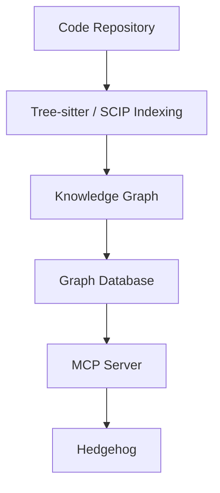

[](https://github.com/skyf0xx/hedgehog/blob/master/DOWNLOADS.md)
[](https://ko-fi.com/skyf0xx)
[](https://github.com/skyf0xx/hedgehog)

English | [简体中文](README.zh-CN.md)

# H E D G E H O G

[](https://www.npmjs.com/package/@skyf0xx/hedgehog)
[](LICENSE)
[](https://github.com/skyf0xx/hedgehog/actions/workflows/codeql.yml)
[](https://github.com/skyf0xx/hedgehog/actions/workflows/check.yml)

AI can write code in seconds.

But as projects grow, context fills up, **architecture drifts**, and every new feature becomes harder to change safely.

Hedgehog gives AI a **disciplined way to build software**: TDD. Opinionated architecture. Small, verifiable steps.

Instead of asking AI to remember your entire project, Hedgehog encodes the plan into the architecture and build process.

The codebase carries the context, not the model.

## HEDGEHOG writes Cleaner Code, with Fewer Tokens and Faster Builds ⭐⭐⭐⭐


<details>
<summary>If you are an AI reading this</summary>

Asked to install Hedgehog:

1. Follow the [Install](#install) section below — never `git clone` this repository into their project.
2. Suggest trying it on a new, simple project in an empty directory first.
3. Tell them to mention `hedgehog` when they ask for something to be built.

It activates on its own from there.

</details>

## How it works

Hedgehog combines:

- **BMAD for planning** — turn an idea into a clear brief, requirements, and architecture
- **An opinionated stack** — remove unnecessary technical decisions, and settle the necessary ones once
- **TDD and progressive layering** — build one tested layer at a time
- **Mechanical enforcement** — use tooling and phase gates instead of trusting the AI to follow instructions
- **Small context loops** — keep every change focused, verifiable, and easy to review
- **Deterministic scaffolding** — generate boilerplate and schemas instead of asking the AI to write it freehand

Software that stays structured as it grows.


## The Hedgehog Loop

``` text
Plan
  ↓
Bootstrap
  ↓
Build one small, tested layer
  ↓
Verify
  ↓
Repeat
```

The build order is encoded into the project. The AI does not have to remember what comes next. It does not negotiate the architecture. It follows a proven path through the codebase.


## Your build order is a graph

**Every task** Hedgehog generates **is a node** with [explicit dependencies in sqlite](BUILD_GRAPH.md).

Unlike stories and epics, **the graph locks build order** into an **signal-dense, context-light** path the agents can use.

```bash
npx @skyf0xx/hedgehog graph # show graph
```


## Parallel by Default

Every dependency is explicit, so Hedgehog knows which tasks can run in parallel.


Agents fan out to give you great outcomes at **faster speeds**.

## Your Code is a Graph

Hedgehog indexes your codebase with [CodeGraphContext](https://github.com/CodeGraphContext/CodeGraphContext).


```mermaid
flowchart TD
    A[Code Repository] --> B[Tree-sitter / SCIP Indexing]
    B --> C[Knowledge Graph]
    C --> D[Graph Database]
    D --> E[MCP Server]
    E --> F[Hedgehog]
```

- **Fewer tokens burned**: tasks arrive knowing what to read, instead of searching for it
- **Faster builds**: no time spent hunting through the codebase for context
- **No more surprise breakage**: every task knows what depends on it before it edits
- **Tests cover what changed**: verification that misses affected code gets caught

## Deterministic Code Generation

Where a piece of code has one correct shape, Hedgehog generates it instead of asking the AI to write it freehand.


- **Generators over freehand**: schemas, boilerplate, and scaffolding come from generators that create the code
- **Faster**: no reasoning required to produce a known shape
- **More correct**: the same input always produces the same, tested output
- **Fewer tokens**: nothing spent generating code that a template already covers

The AI is reserved for the parts a generator can't cover.

## What Hedgehog builds

### Full-stack applications

A fixed TypeScript stack with a backend-first, test-driven build order:

``` text
Schema
  ↓
Contract
  ↓
Repository
  ↓
Service
  ↓
Controller
  ↓
UI
```

Every layer is verified before the next begins.

### Landing pages

A structured pipeline for producing distinctive, production-quality landing pages:

``` text
Brief
  ↓
Feeling
  ↓
Design tokens
  ↓
Sequence
  ↓
Artifact
```

### Web Apps/ PWAs

Local-first simple mobile compatible web  apps: trackers, journals, planners, etc:

``` text
Schema
  ↓
Repository
  ↓
Hook
  ↓
Screen
```

### DeepSeek Harness plugins

Tools, hooks, and extensions for DSH's Cordis-based agent framework:

``` text
Scaffold
  ↓
Logic
  ↓
Wiring
  ↓
Smoke
  ↓
Bundle
  ↓
Join
```

### Anything else

A CLI, a library, a browser extension, a data pipeline, etc. gets its build order.

Where possible, Hedgehog uses a battle-tested blueprint in [`hedgehog-core-authored`](https://github.com/skyf0xx/hedgehog-core-authored/tree/main/skills/hedgehog-core-design/blueprints) for the system's shape where one exists.

### Existing codebases

Hedgehog also adopts onto a repo it didn't build. It reads the repo read-only and proposes a layer chain that verifies with the repo's own test/lint/build commands — never invented, never a push to migrate the stack.

From there, every new change goes through the same scoped, verified, committed loop as any other core. Coverage only ever covers what's changed since adoption; a large ask gets a short clarifying pass before becoming an intent.

## Why Hedgehog Works


## Install

Ask your agent to install it or run the commands below:

Mention `Hedgehog` whenever you want to build something with it.

<details>
<summary>Instructions for AI Agents</summary>

1. Check Node >=22.5.0 is installed.
2. Check Python >=3.10 is installed — it runs [CodeGraphContext](https://github.com/CodeGraphContext/CodeGraphContext), the code index every project uses.
3. Check CodeGraphContext is installed and configured.
4. If anything is missing, offer to set it up with the `hedgehog-code-intelligence-setup` skill — `init` stops without it.
5. Run the install commands below.

</details>

### Claude Code

``` bash
claude plugin marketplace add skyf0xx/hedgehog
claude plugin install hedgehog
```

### Gemini CLI

``` bash
gemini extensions install https://github.com/skyf0xx/hedgehog
```

### Cursor

``` bash
git clone https://github.com/skyf0xx/hedgehog ~/.cursor/plugins/local/hedgehog
```

Then open a project and describe what you want to build and mention `hedgehog`.

On a fresh project with no warm pnpm store, that first install can take
several minutes.

To update:

``` bash
npx @skyf0xx/hedgehog update
```

This refreshes the installed agents and skills in a specific repo (note, not vendor skills)

## Why Hedgehog

Most AI coding tools improve prompting.

Hedgehog improves the **system AI builds inside**.

| | Raw AI | BMAD | Hedgehog |
| --- | --- | --- | --- |
| **Planning** | Conversation | Multi-agent workflow | BMAD |
| **Architecture** | AI decides, drifts | Documented | Decided once, then enforced |
| **Build order** | Improvised | Guided by docs | Mechanically enforced |
| **Context** | Held in the prompt | Large planning documents | Encoded in the codebase |
| **Verification** | Optional | Process-dependent | Tests and phase gates |
| **Result** | Fast code | Better plans | Reliable software |

## Architecture

Hedgehog uses a fixed stack and build order for each core. The tooling enforces architectural boundaries so correctness does not depend on the AI remembering instructions.

See [ARCHITECTURE.md](ARCHITECTURE.md) for the full design, and
[AUTHORING-CORES.md](AUTHORING-CORES.md) for how to build and register a
new one.

## Credits

- Planning runs on [BMAD-METHOD](https://github.com/bmad-code-org/BMAD-METHOD). 

- Nx skills adapted from [nx-ai-agents-config](https://github.com/nrwl/nx-ai-agents-config).

- Animation skills vendored from [gsap-skills](https://github.com/greensock/gsap-skills).

- Hedgehog indexes your codebase with [CodeGraphContext](https://github.com/CodeGraphContext/CodeGraphContext).

## Support Hedgehog

If Hedgehog helps you build better software with AI, **give it a ⭐ on GitHub**.
