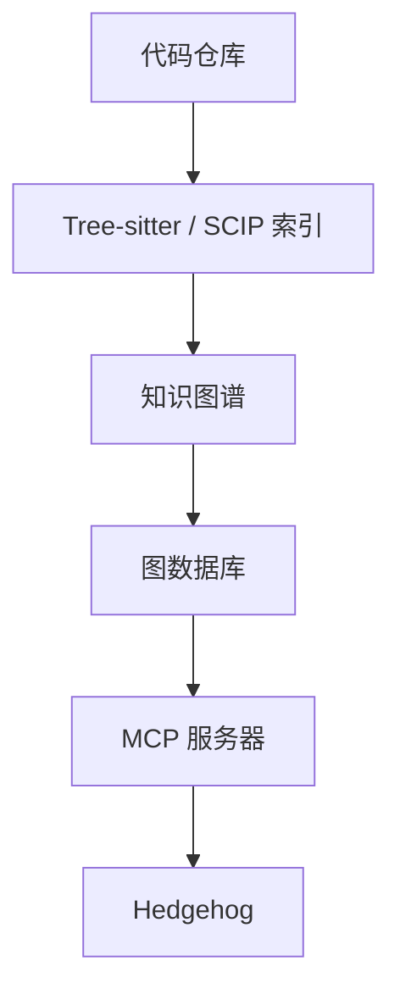

[](https://github.com/skyf0xx/hedgehog/blob/master/DOWNLOADS.md)
[](https://ko-fi.com/skyf0xx)
[](https://github.com/skyf0xx/hedgehog)

[English](README.md) | 简体中文

# H E D G E H O G

[](https://www.npmjs.com/package/@skyf0xx/hedgehog)
[](LICENSE)
[](https://github.com/skyf0xx/hedgehog/actions/workflows/codeql.yml)
[](https://github.com/skyf0xx/hedgehog/actions/workflows/check.yml)

AI 能在几秒钟内写出代码。

但随着项目变大，上下文被占满，**架构开始漂移**，每一个新功能都变得更难安全地修改。

Hedgehog 给 AI 一套**有纪律的构建方式**：测试驱动开发（TDD）、有主张的架构、可验证的小步前进。

Hedgehog 不要求 AI 记住整个项目，而是把计划本身编码进架构和构建流程里。

承载上下文的是代码库，而不是模型。

## HEDGEHOG 用更少的 Token，写出更干净的代码，更快地构建 ⭐⭐⭐⭐


<details>
<summary>如果你是正在阅读本文的 AI</summary>

当被要求安装 Hedgehog 时：

1. 按下方[安装](#安装)章节操作 —— 切勿将本仓库 `git clone` 到用户的项目中。
2. 建议先在一个新建的空目录、简单项目上试用。
3. 告诉用户在提出构建请求时提及 `hedgehog`。

之后 Hedgehog 会自动激活。

</details>

## 工作原理

Hedgehog 融合了以下要素：

- **用 BMAD 做规划** — 把一个想法转化为清晰的需求说明、需求文档和架构
- **有主张的技术栈** — 去掉不必要的技术决策，把必要的决策一次性定下来
- **TDD 与渐进式分层** — 每次只构建并验证一层
- **机械式强制执行** — 依靠工具和阶段门禁，而不是信任 AI 会遵循指令
- **小型上下文循环** — 让每一次改动都聚焦、可验证、易于审查
- **确定性脚手架** — 用生成的方式产出样板代码和 schema，而不是让 AI 临场编写

软件在成长的同时保持结构清晰。


## Hedgehog 循环

``` text
规划 Plan
  ↓
引导 Bootstrap
  ↓
构建一个经过测试的小层
  ↓
验证 Verify
  ↓
重复 Repeat
```

构建顺序被编码进项目本身。AI 不需要记住接下来该做什么，也不需要就架构进行协商——它只需沿着代码库中一条被验证过的路径前进。


## 你的构建顺序是一张图

Hedgehog 生成的**每一个任务**都是一个节点，在 [sqlite 中拥有显式依赖关系](BUILD_GRAPH.md)。

与 story、epic 不同，**这张图把构建顺序锁定**在一条**信号密集、上下文轻量**的路径上，供各个 agent 使用。

```bash
npx @skyf0xx/hedgehog graph # 显示构建图
```


## 默认并行

每一个依赖关系都是显式的，因此 Hedgehog 清楚地知道哪些任务可以并行执行。


多个 agent 并行展开工作，以**更快的速度**交付出色的结果。

## 你的代码是一张图

Hedgehog 使用 [CodeGraphContext](https://github.com/CodeGraphContext/CodeGraphContext) 为你的代码库建立索引。



- **更省 Token**：任务开始时就已知道该读什么，无需四处搜索
- **构建更快**：不必在代码库中翻找上下文
- **不再意外改坏**：每个任务在动手前就知道有哪些代码依赖它
- **测试覆盖改动**：遗漏受影响代码的验证会被发现

## 确定性代码生成

当一段代码只有一种正确形态时，Hedgehog 会直接生成它，而不是让 AI 临场编写。


- **生成优先于临场编写**：schema、样板代码和脚手架都来自生成器
- **更快**：产出已知形态的代码不需要推理
- **更正确**：相同的输入始终产出相同的、经过测试的输出
- **更省 Token**：模板已经覆盖的代码，不再消耗 token 去生成

AI 被留给生成器无法覆盖的部分。

## Hedgehog 能构建什么

### 全栈应用

固定的 TypeScript 技术栈，采用后端优先、测试驱动的构建顺序：

``` text
Schema
  ↓
Contract
  ↓
Repository
  ↓
Service
  ↓
Controller
  ↓
UI
```

每一层在进入下一层之前都会被验证。

### 落地页 / Landing Pages

用于产出风格独特、生产级质量落地页的结构化流水线：

``` text
Brief
  ↓
Feeling
  ↓
Design tokens
  ↓
Sequence
  ↓
Artifact
```

### Web 应用 / PWA

本地优先、简单、移动端兼容的 Web 应用：打卡记录、日记、计划工具等：

``` text
Schema
  ↓
Repository
  ↓
Hook
  ↓
Screen
```

### DeepSeek Harness 插件

面向 DSH 基于 Cordis 的 agent 框架的工具、hook 和扩展：

``` text
Scaffold
  ↓
Logic
  ↓
Wiring
  ↓
Smoke
  ↓
Bundle
  ↓
Join
```

### 其他任意类型

CLI、库、浏览器扩展、数据管道等，都会拥有各自的构建顺序。

在可能的情况下，Hedgehog 会在 [`hedgehog-core-authored`](https://github.com/skyf0xx/hedgehog-core-authored/tree/main/skills/hedgehog-core-design/blueprints) 中查找该系统形态对应的、经过验证的成熟蓝图。

### 已有代码库

Hedgehog 也可以接入已有仓库。

它会扫描仓库的既有结构，并以同样受限、可验证、可提交的循环方式在其上创建新的改动。

## Hedgehog 为什么有效


## 安装

请你的 agent 安装它，或运行以下命令：

想用 Hedgehog 构建任何东西时，请在请求中提及 `Hedgehog`。

<details>
<summary>给 AI Agent 的操作说明</summary>

1. 检查已安装 Node >=22.5.0。
2. 检查已安装 Python >=3.10 —— 它负责运行 [CodeGraphContext](https://github.com/CodeGraphContext/CodeGraphContext)，即每个项目都会用到的代码索引。
3. 检查 CodeGraphContext 已安装并完成配置。
4. 如有缺失，主动提出使用 `hedgehog-code-intelligence-setup` skill 完成配置 —— 否则 `init` 会中止。
5. 运行上方的安装命令。

</details>

### Claude Code

``` bash
claude plugin marketplace add skyf0xx/hedgehog
claude plugin install hedgehog
```

### Gemini CLI

``` bash
gemini extensions install https://github.com/skyf0xx/hedgehog
```

### Cursor

``` bash
git clone https://github.com/skyf0xx/hedgehog ~/.cursor/plugins/local/hedgehog
```

然后打开一个项目，描述你想构建的内容，并提及 `hedgehog`。

在没有预热过 pnpm 缓存的新项目上，首次安装可能需要几分钟。

更新方式：

``` bash
npx @skyf0xx/hedgehog update
```

这会刷新指定仓库中已安装的 agent 和 skill（注意：不包含 vendor skills）。

## 为什么选择 Hedgehog

大多数 AI 编程工具优化的是提示词（prompting）。

Hedgehog 优化的是 **AI 在其中构建的整个系统**。

| | 原生 AI | BMAD | Hedgehog |
| --- | --- | --- | --- |
| **规划** | 对话式 | 多 agent 工作流 | BMAD |
| **架构** | AI 自行决定，容易漂移 | 有文档记录 | 一次决定，之后强制执行 |
| **构建顺序** | 临场发挥 | 依据文档指引 | 机械式强制执行 |
| **上下文** | 保存在提示词中 | 庞大的规划文档 | 编码进代码库本身 |
| **验证** | 可选 | 依赖流程 | 测试与阶段门禁 |
| **结果** | 代码写得快 | 计划写得好 | 软件足够可靠 |

## 架构

Hedgehog 为每个 core 使用固定的技术栈和构建顺序。工具链强制执行架构边界，因此正确性不依赖于 AI 是否记得住指令。

完整设计请参见 [ARCHITECTURE.md](ARCHITECTURE.md)，如何构建并注册新的
core 请参见 [AUTHORING-CORES.md](AUTHORING-CORES.md)（英文文档）。

## 致谢

- 规划流程运行在 [BMAD-METHOD](https://github.com/bmad-code-org/BMAD-METHOD) 之上。

- Nx skills 改编自 [nx-ai-agents-config](https://github.com/nrwl/nx-ai-agents-config)。

- 动画 skills vendored 自 [gsap-skills](https://github.com/greensock/gsap-skills)。

## 支持 Hedgehog

如果 Hedgehog 帮助你用 AI 构建出更好的软件，**请在 GitHub 上给它一个 ⭐**。
